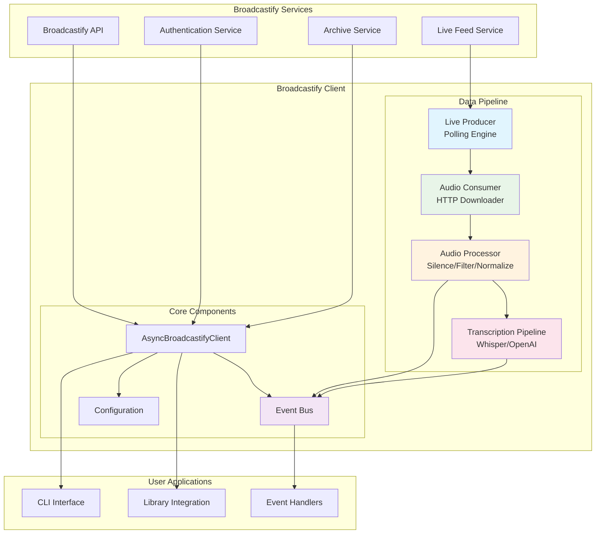
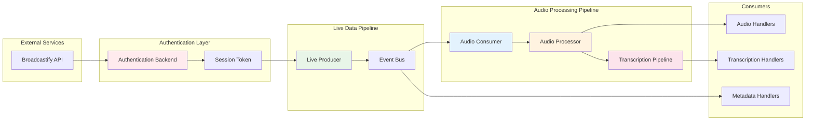
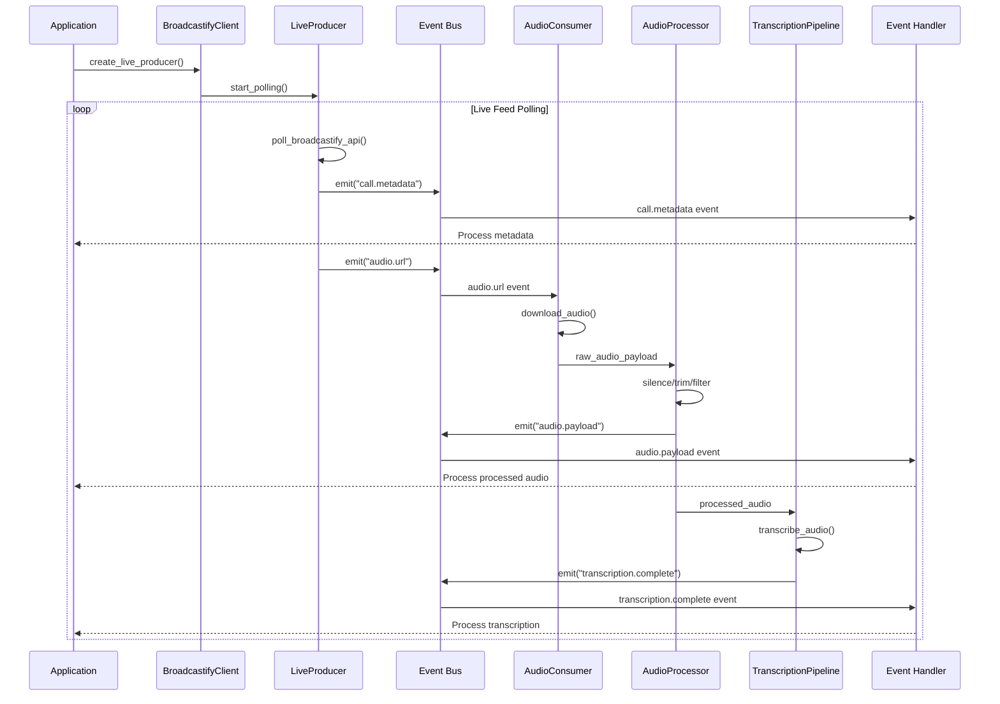
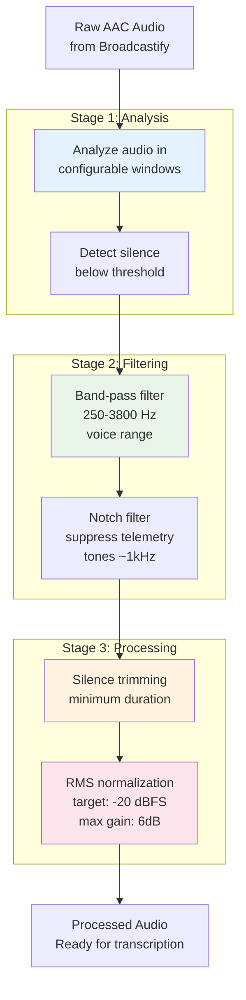
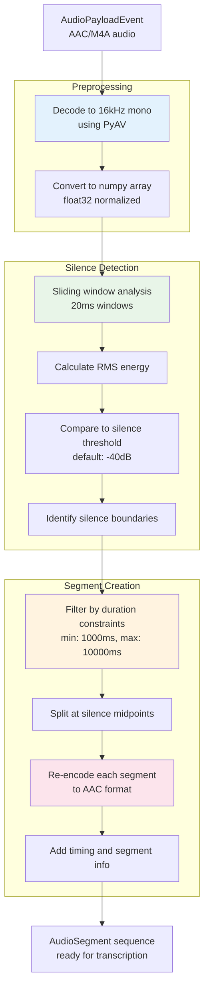
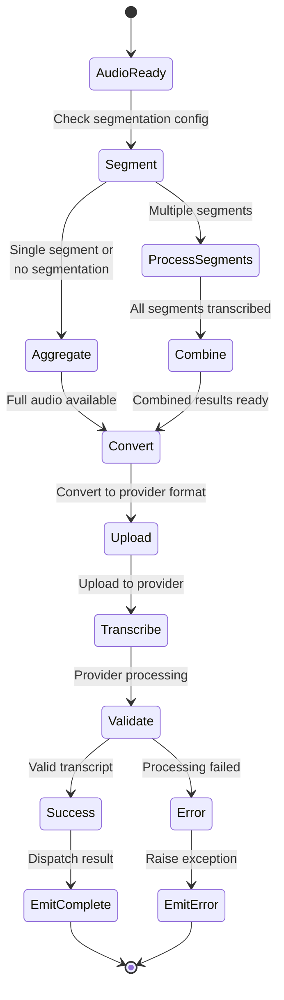
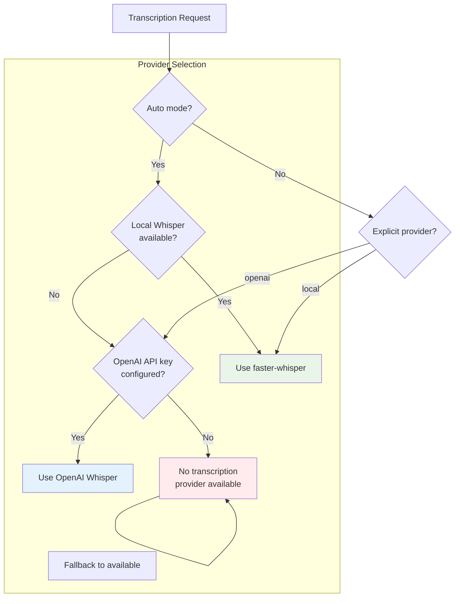
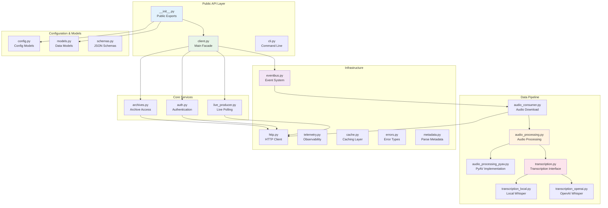

# Broadcastify Calls

An async-first Python client for integrating with Broadcastify live call feeds, archive metadata, and optional transcription pipelines. This library provides a clean, type-safe interface for consuming real-time emergency communications data with built-in support for audio processing and transcription.

## System Overview



## Quick Start Flow

### CLI Usage Flow
```
┌─────────────────┐    ┌──────────────────┐    ┌─────────────────┐
│   User Command  │───▶│   CLI Parser     │───▶│  Authentication │
│                 │    │                  │    │                 │
│ broadcastify_   │    │ Parse args &     │    │ Login to        │
│ calls --system  │    │ validate config  │    │ Broadcastify    │
│ 123 --username  │    │                  │    │                 │
└─────────────────┘    └──────────────────┘    └─────────────────┘
                                                        │
                                                        ▼
┌─────────────────┐    ┌──────────────────┐    ┌─────────────────┐
│   Output &      │◀───│   Event Bus      │◀───│  Live Producer  │
│   Logging       │    │                  │    │                 │
│                 │    │ Dispatch events  │    │ Poll live feeds │
│ Print audio     │    │ to handlers      │    │ and audio URLs  │
│ metadata &      │    │                  │    │                 │
│ transcriptions  │    │                  │    │                 │
└─────────────────┘    └──────────────────┘    └─────────────────┘
```

### Library Integration Flow
```
┌─────────────────┐    ┌──────────────────┐    ┌─────────────────┐
│   Application   │───▶│   Client Setup   │───▶│  Configuration  │
│                 │    │                  │    │                 │
│ Create client   │    │ AsyncBroadcast-  │    │ Credentials,    │
│ instance &      │    │ ifyClient()      │    │ dependencies,   │
│ register events │    │                  │    │ options         │
└─────────────────┘    └──────────────────┘    └─────────────────┘
                                                        │
                                                        ▼
┌─────────────────┐    ┌──────────────────┐    ┌─────────────────┐
│  Event Handlers │◀───│   Event Bus      │◀───│  Data Pipeline  │
│                 │    │                  │    │                 │
│ Process audio,  │    │ Route events to  │    │ Download,       │
│ transcriptions, │    │ registered funcs │    │ process, trans- │
│ metadata        │    │                  │    │ cribe audio     │
└─────────────────┘    └──────────────────┘    └─────────────────┘
```

## Quick Start

### Prerequisites

- **Python 3.13+** (managed automatically by uv)
- **uv** 0.4 or newer for package management

### Installation

```bash
# Clone and install base dependencies
git clone <repository-url>
cd broadcastify-calls
uv sync --group dev

# Optional: Add transcription support
uv sync --group dev --group transcription        # OpenAI Whisper
uv sync --group dev --group transcription_local  # Local Whisper (faster-whisper)

# Optional: Add telemetry and audio processing
uv sync --group dev --group telemetry
uv sync --group dev --group audio_processing
```

## Command Line Interface

The CLI provides immediate access to live call streaming for testing and monitoring purposes.

### Basic Usage

```bash
# Stream live calls from a specific system
uv run broadcastify_calls --system-id 123

# Monitor specific talkgroups (repeat flag for multiple)
uv run broadcastify_calls --system-id 123 --talkgroup-id 456 --talkgroup-id 789

# Monitor a playlist
uv run broadcastify_calls --playlist-id "your-playlist-guid"

# Use environment variables for credentials
export LOGIN=your_username
export PASSWORD=your_password
uv run broadcastify_calls --system-id 123
```

### CLI Configuration Options

#### Authentication
- Environment variables: `LOGIN`, `PASSWORD` (loaded from .env file)
- Optional `--dotenv`: Path to .env file containing credentials
- The CLI does not support direct credential arguments for security

#### Live Feed Control
- `--system-id`: Broadcastify system identifier (required unless using playlist)
- `--talkgroup-id`: Talkgroup identifier (repeat for multiple, requires --system-id)
- `--playlist-id`: Playlist GUID to monitor (mutually exclusive with system/talkgroup)
- `--history`: Number of historical calls to emit on first fetch (0 = live only)
- `--initial-position`: Initial cursor position in seconds to resume from

#### Output & Debugging
- `--log-level`: Logging verbosity (CRITICAL, ERROR, WARNING, INFO, DEBUG)
- `--metadata-limit`: Maximum number of metadata key/value pairs to display per event
- `--dump-audio`: Persist raw audio for inspection
- `--dump-audio-dir`: Directory for dumped audio files (defaults to ./audio-dumps)

#### Audio Processing
```bash
# Enable all audio processing stages
uv run broadcastify_calls --system-id 123 --audio-processing all

# Enable specific stages
uv run broadcastify_calls --system-id 123 --audio-processing trim,bandpass

# Configure silence trimming
uv run broadcastify_calls --system-id 123 \
  --audio-silence-threshold-db -40 \
  --audio-min-silence-ms 500 \
  --audio-analysis-window-ms 50

# Configure band-pass filtering
uv run broadcastify_calls --system-id 123 \
  --audio-low-cut-hz 300 \
  --audio-high-cut-hz 3500
```

#### Transcription
```bash
# Enable transcription (requires OPENAI_API_KEY environment variable)
uv run broadcastify_calls --system-id 123 --transcription

# Transcription automatically uses OpenAI Whisper when OPENAI_API_KEY is set
# The CLI does not support provider selection - this is configured via environment
```

## Library Integration

The client is designed for programmatic use in async applications. Here's how to integrate it:

### Basic Client Setup

```python
import asyncio
import logging
from broadcastify_client import (
    BroadcastifyClient,
    Credentials,
)

async def main():
    # Configure authentication
    credentials = Credentials(
        username="your_username",
        password="your_password"
        # or api_key="your_api_key"
    )

    # Create client
    client = BroadcastifyClient()

    try:
        # Authenticate
        await client.authenticate(credentials)

        # Create live producer for specific talkgroup
        handle = await client.create_live_producer(
            system_id=123,
            talkgroup_id=456
        )

        # Register event handlers before starting
        @client.register_consumer("calls.audio")
        async def handle_audio(event):
            print(f"Received audio for call: {event.call_id}")
            # Process audio payload here

        @client.register_consumer("transcription.complete")
        async def handle_transcription(result):
            print(f"Transcription: {result.text}")

        # Start the client
        await client.start()

        # Keep running
        await asyncio.Event().wait()

    finally:
        await client.shutdown()

if __name__ == "__main__":
    logging.basicConfig(level=logging.INFO)
    asyncio.run(main())
```

### Advanced Configuration

```python
from broadcastify_client import (
    BroadcastifyClient,
    BroadcastifyClientDependencies,
    Credentials,
    AudioProcessingConfig,
    TranscriptionConfig,
    HttpClientConfig,
)

# Configure all aspects of the client
dependencies = BroadcastifyClientDependencies(
    http_config=HttpClientConfig(
        timeout=30.0,
        max_connections=10,
        http2=True
    ),
    audio_processing_config=AudioProcessingConfig(
        stages={"trim", "bandpass"},
        silence_threshold_db=-40,
        min_silence_duration_ms=500,
        low_cut_hz=250,
        high_cut_hz=3800
    ),
    transcription_config=TranscriptionConfig(
        provider="openai",  # or "local"
        model="whisper-1",
        language="en",
        enabled=True,
        api_key="your-openai-api-key"  # or set OPENAI_API_KEY environment variable
    )
)

client = BroadcastifyClient(dependencies=dependencies)
```

### Event-Driven Architecture

The client uses an event bus pattern for decoupled event handling:

```python
from broadcastify_client import AudioPayloadEvent, TranscriptionResult, LiveCallEnvelope

# Register handlers for different event types
@client.register_consumer("calls.audio")
async def on_audio_payload(event: AudioPayloadEvent) -> None:
    """Handle incoming audio data."""
    print(f"Audio received: {event.call_id}, size: {len(event.payload)} bytes")
    print(f"Content type: {event.content_type}")
    print(f"Audio range: {event.start_offset:.2f}s - {event.end_offset:.2f}s")

@client.register_consumer("transcription.complete")
async def on_transcription_complete(result: TranscriptionResult) -> None:
    """Handle transcription results."""
    print(f"Transcription: {result.text}")
    print(f"Language: {result.language}")
    print(f"Average log probability: {result.average_logprob}")
    print(f"Segments: {len(result.segments)}")

@client.register_consumer("calls.live")
async def on_call_metadata(envelope: LiveCallEnvelope) -> None:
    """Handle live call metadata updates."""
    call = envelope.call
    print(f"Call: {call.system_id}:{call.talkgroup_id}")
    print(f"Source: {call.source_name}")
    print(f"Frequency: {call.frequency_mhz} MHz")
    print(f"Duration: {call.duration_seconds}s")
    print(f"Cursor: {envelope.cursor}")
```

### Archive Access

Access historical call data:

```python
from datetime import datetime, UTC
from broadcastify_client import TimeWindow

# Note: Archive API uses time_block integers, not time windows
# Each time_block represents a 30-minute period starting from epoch
import time
start_time = datetime(2024, 1, 1, tzinfo=UTC)
time_block = int(start_time.timestamp() // 1800)  # 1800 seconds = 30 minutes

# Search archived calls for a specific time block
results = await client.get_archived_calls(
    system_id=123,
    talkgroup_id=456,
    time_block=time_block
)

for envelope in results.calls:
    call = envelope.call
    print(f"Found call at {call.received_at}: {call.source_name}")
    print(f"Duration: {call.duration_seconds}s")

# Check if result was from cache
print(f"Cache hit: {results.cache_hit}")
print(f"Time window: {results.window.start} to {results.window.end}")
```

## Architecture Overview

### Core Components

1. **Authentication Backend** - Handles session management and token refresh
2. **Live Producer** - Polls Broadcastify for real-time call events
3. **Audio Consumer** - Downloads and processes call audio streams
4. **Event Bus** - Decoupled event distribution system
5. **Transcription Pipeline** - Optional speech-to-text processing
6. **Audio Processor** - Silence trimming, filtering, normalization

### Data Flow



### Configuration System

The library uses a layered configuration approach:

```
┌─────────────────────────────────────────────────────────────┐
│                    Runtime Overrides                        │
│                 CLI Flags & Direct API                      │
└─────────────────────────┬───────────────────────────────────┘
                          │
┌─────────────────────────▼───────────────────────────────────┐
│                Programmatic Configuration                   │
│           BroadcastifyClientDependencies Objects            │
└─────────────────────────┬───────────────────────────────────┘
                          │
┌─────────────────────────▼───────────────────────────────────┐
│                Environment Variables                        │
│         BROADCASTIFY_*, AUDIO_*, OPENAI_API_KEY             │
└─────────────────────────┬───────────────────────────────────┘
                          │
┌─────────────────────────▼───────────────────────────────────┐
│                    Default Values                           │
│              Built-in Configuration Constants               │
└─────────────────────────────────────────────────────────────┘
```

### Event Flow Architecture



### Error Handling
The client provides structured error handling:

```python
from broadcastify_client.errors import (
    AuthenticationError,
    AudioDownloadError,
    TranscriptionError,
    BroadcastifyError
)

try:
    await client.authenticate(credentials)
except AuthenticationError as e:
    logger.error(f"Authentication failed: {e}")
    # Handle authentication failure
except BroadcastifyError as e:
    logger.error(f"Broadcastify client error: {e}")
    # Handle other client errors
```

## Audio Processing Details

### Audio Processing Pipeline



### Silence Trimming
When enabled (`trim` stage), the client:
- Analyzes audio in configurable windows (default: 50ms)
- Removes silence below threshold (default: -40dB)
- Ensures minimum silence duration (default: 500ms)
- Requires `av` (PyAV) package for processing

### Band-Pass Filtering
- Filters frequencies outside human voice range (250-3800 Hz)
- Reduces noise and improves transcription accuracy
- Configurable cutoff frequencies

### Normalization
- RMS normalization to -20 dBFS
- 6 dB upward gain cap to prevent amplification
- Ensures consistent audio levels for transcription

## Audio Segmentation

The library includes advanced audio segmentation functionality designed to optimize Whisper transcription performance by splitting longer audio recordings into smaller, more manageable chunks based on silence detection.

### Why Audio Segmentation?

- **Improved Accuracy**: Shorter audio segments reduce context loss and improve transcription accuracy
- **Better Performance**: Whisper processes shorter segments more efficiently
- **Parallel Processing**: Segments can be processed in parallel for faster overall transcription
- **Error Isolation**: Issues with one segment don't affect the entire recording

### Segmentation Workflow



### Using Audio Segmentation

```python
from broadcastify_client import (
    BroadcastifyClient,
    AudioSegmenter,
    AudioSegment,
    TranscriptionConfig,
    AudioPayloadEvent
)

# Configure segmentation parameters
transcription_config = TranscriptionConfig(
    provider="openai",
    model="whisper-1",
    enabled=True,
    # Segmentation settings
    whisper_segment_min_duration_ms=1000,    # Minimum segment length
    whisper_segment_max_silence_ms=10000,    # Maximum silence to split on
    whisper_segment_min_silence_ms=500,      # Minimum silence duration
    whisper_silence_threshold_db=-40         # Silence detection threshold
)

# Create segmenter
segmenter = AudioSegmenter(transcription_config)

# Segment an audio event
async def process_audio_event(event: AudioPayloadEvent) -> None:
    try:
        segments = segmenter.segment_event(event)

        for segment in segments:
            print(f"Segment {segment.segment_id + 1}/{segment.total_segments}")
            print(f"Duration: {segment.duration:.2f}s")
            print(f"Range: {segment.start_offset:.2f}s - {segment.end_offset:.2f}s")

            # Send segment for transcription
            # await transcribe_segment(segment)

    except AudioSegmentationError as e:
        print(f"Segmentation failed: {e}")
```

### Integration with Transcription Pipeline

```python
from broadcastify_client import (
    BroadcastifyClient,
    AudioSegmenter,
    TranscriptionConfig,
    AudioPayloadEvent,
    TranscriptionResult
)

class SegmentedTranscriptionPipeline:
    def __init__(self, transcription_config: TranscriptionConfig):
        self.segmenter = AudioSegmenter(transcription_config)
        self.transcription_config = transcription_config

    async def process_with_segmentation(self, event: AudioPayloadEvent) -> list[TranscriptionResult]:
        """Process audio with automatic segmentation."""
        segments = self.segmenter.segment_event(event)

        if len(segments) == 1:
            # No segmentation needed, process as single segment
            return [await self._transcribe_segment(segments[0])]

        # Process segments in parallel
        results = await asyncio.gather(*[
            self._transcribe_segment(segment) for segment in segments
        ])

        # Combine results maintaining order
        return self._combine_transcription_results(results, segments)

    async def _transcribe_segment(self, segment: AudioSegment) -> TranscriptionResult:
        """Transcribe a single audio segment."""
        # Implementation would send segment to transcription provider
        pass

    def _combine_transcription_results(
        self,
        results: list[TranscriptionResult],
        segments: list[AudioSegment]
    ) -> list[TranscriptionResult]:
        """Combine segment results with proper timing information."""
        combined_results = []

        for i, (result, segment) in enumerate(zip(results, segments)):
            # Adjust timing to be relative to original audio
            combined_result = TranscriptionResult(
                call_id=result.call_id,
                text=result.text,
                language=result.language,
                average_logprob=result.average_logprob,
                segments=result.segments,
                segment_id=i,
                total_segments=len(segments),
                segment_start_time=segment.start_offset
            )
            combined_results.append(combined_result)

        return combined_results
```

### Segmentation Configuration

| Parameter | Description | Default | Recommended Range |
|-----------|-------------|---------|------------------|
| `whisper_segment_min_duration_ms` | Minimum segment length in milliseconds | 1000 | 500-2000 |
| `whisper_segment_max_silence_ms` | Maximum silence duration to split on | 10000 | 5000-15000 |
| `whisper_segment_min_silence_ms` | Minimum silence duration for valid split | 500 | 200-1000 |
| `whisper_silence_threshold_db` | RMS threshold for silence detection | -40 | -50 to -30 |

### Technical Implementation Details

#### Audio Processing Pipeline
1. **Decoding**: AAC/M4A audio is decoded to 16kHz mono using PyAV
2. **Analysis**: Sliding window RMS analysis (20ms windows) identifies silence
3. **Boundary Detection**: Silence periods within duration constraints are marked
4. **Segmentation**: Audio is split at silence midpoints to preserve content
5. **Re-encoding**: Each segment is re-encoded to AAC for compatibility

#### Supported Formats
- **Input**: `audio/mp4`, `audio/m4a`, `audio/aac`
- **Output**: AAC-encoded segments with same quality as input
- **Sample Rate**: Always resampled to 16kHz (Whisper optimal)

#### Performance Considerations
- **Memory**: Segmentation processes audio in memory - very large files may need chunking
- **CPU**: PyAV decoding and numpy analysis are CPU-intensive but fast
- **Dependencies**: Requires `av` (PyAV) and `numpy` packages
- **Parallel Processing**: Segments can be transcribed independently

### Error Handling

```python
from broadcastify_client.audio_segmentation import AudioSegmentationError

try:
    segments = segmenter.segment_event(event)
except AudioSegmentationError as e:
    if "PyAV is required" in str(e):
        print("Install audio processing: uv sync --group audio-processing")
    elif "Unsupported content type" in str(e):
        print(f"Cannot segment {event.content_type}, use original audio")
    elif "No audio stream found" in str(e):
        print("Audio payload is corrupted or invalid")
    else:
        print(f"Segmentation failed: {e}")
```

## Transcription Pipeline

### Transcription Workflow



### Provider Selection Logic



### Provider Support
- **OpenAI Whisper**: Cloud-based, high accuracy
- **Local Whisper**: Offline processing via faster-whisper
- **Auto-selection**: Prefers local, falls back to OpenAI

### Workflow
1. Audio aggregation for complete call
2. Format conversion (AAC → provider format)
3. Single transcription request per call
4. Result validation and error handling
5. Event emission with transcription metadata

### Error Behavior
- Strict error surfacing - failures raise exceptions
- No silent fallback to empty results
- Detailed error logging for debugging

## Development & Testing

### Development Commands

```bash
# Code quality checks
uv run ruff check          # Linting
uv run ruff format         # Formatting
uv run pyright            # Type checking

# Testing
uv run pytest             # Run all tests
uv run pytest --cov       # With coverage
uv run pytest -k "test_auth"  # Specific tests
```

### Project Structure

### Project Architecture



```
src/broadcastify_client/
├── __init__.py           # Public API exports
├── client.py            # Main client facade
├── cli.py               # Command line interface
├── config.py            # Configuration models
├── models.py            # Data models
├── schemas.py           # JSON schemas
├── auth.py              # Authentication
├── live_producer.py     # Live polling
├── archives.py          # Archive access
├── audio_consumer.py    # Audio download pipeline
├── audio_processing.py  # Audio processing pipeline
├── audio_processing_pyav.py  # PyAV implementation
├── audio_segmentation.py # Audio segmentation for transcription
├── transcription.py     # Transcription interfaces
├── transcription_local.py  # Local Whisper
├── transcription_openai.py  # OpenAI Whisper
├── eventbus.py          # Event system
├── http.py              # HTTP client abstraction
├── telemetry.py         # Observability
├── cache.py             # Caching layer
├── errors.py            # Error definitions
├── metadata.py          # Metadata parsing
└── py.typed             # Type information
```

## Environment Variables

| Variable | Description | Default |
|----------|-------------|---------|
| `LOGIN` | Username for authentication (loaded from .env) | - |
| `PASSWORD` | Password for authentication (loaded from .env) | - |
| `OPENAI_API_KEY` | OpenAI API key for transcription | - |
| `OPENAI_BASE_URL` | OpenAI API base URL (optional) | - |
| `AUDIO_PROCESSING` | Comma-separated processing stages | - |
| `AUDIO_SILENCE_THRESHOLD_DB` | Silence threshold in dB | -50 |
| `AUDIO_MIN_SILENCE_MS` | Minimum silence duration | 200 |
| `AUDIO_ANALYSIS_WINDOW_MS` | Analysis window size | 20 |
| `AUDIO_LOW_CUT_HZ` | Low frequency cutoff for band-pass | 250 |
| `AUDIO_HIGH_CUT_HZ` | High frequency cutoff for band-pass | 3800 |

## Publishing

For manual PyPI releases, follow the workflow outlined in `docs/RELEASING.md`.

## License

MIT License - see LICENSE file for details.
